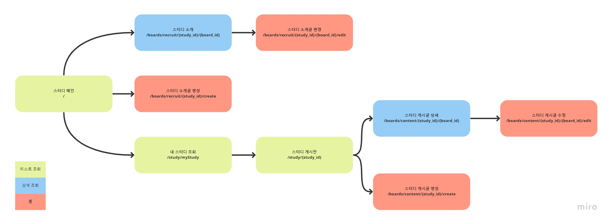

# URL 경로 설계

<figure><figcaption></figcaption></figure>

* **스터디 메인**\
  /
* **스터디 소개글 상세**\
  /boards/recruit/{study\_id}/{board\_id}
* **스터디 소개글 생성**\
  /boards/recruit/create
* **스터디 소개글 수정**\
  /boards/recruit/{study\_id}/{board\_id}/edit
* **내 스터디 조회**\
  /study/myStudy
* **스터디 게시판**\
  /study/{study\_id}
* **스터디 게시글 상세**\
  /boards/content/{study\_id}/{board\_id}
* **스터디 게시글 생성**\
  /boards/content/{study\_id}/create
* **스터디 게시글 수정**\
  /boards/content/{study\_id}/{board\_id}/edit
